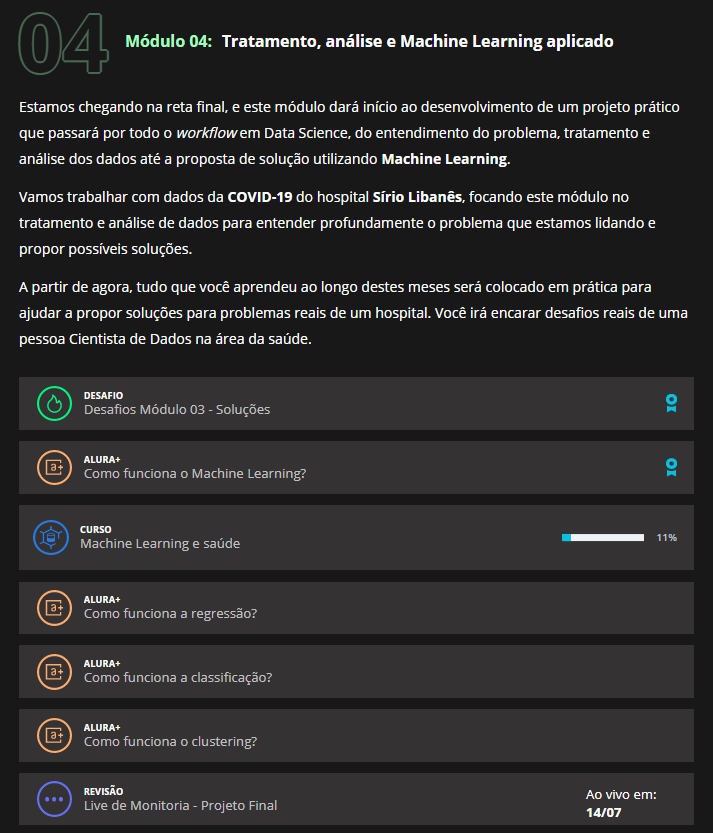

# bootcampDS_Mod04
Módulo 04 do bootcamp de Data Science da Alura. a solução será implementada diretamente no notebook do Kaggle: https://www.kaggle.com/cmrocha/previs-o-de-uti-de-covid-19/edit

Base: https://www.kaggle.com/S%C3%ADrio-Libanes/covid19

